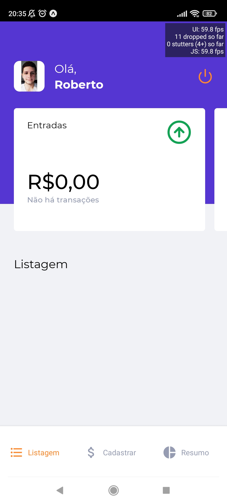
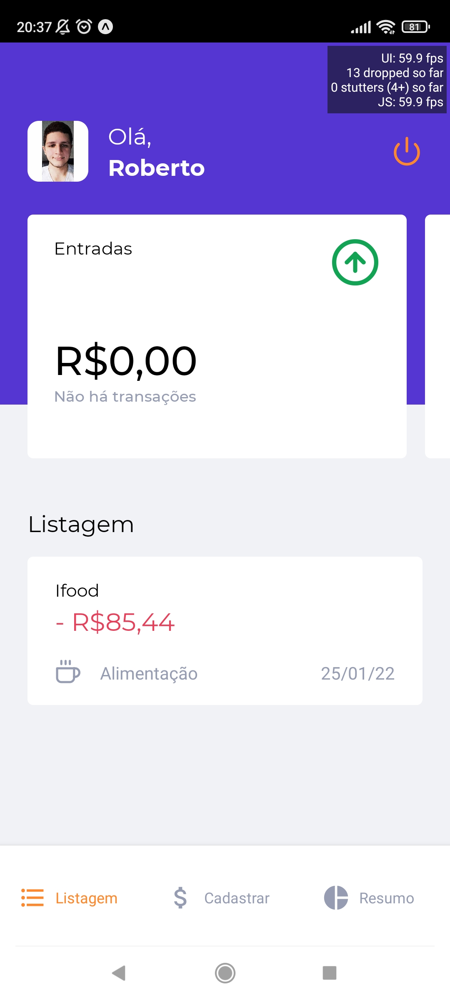
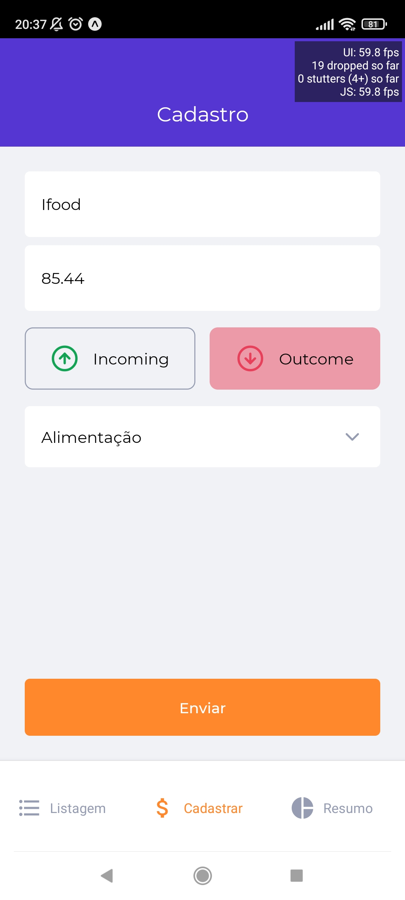
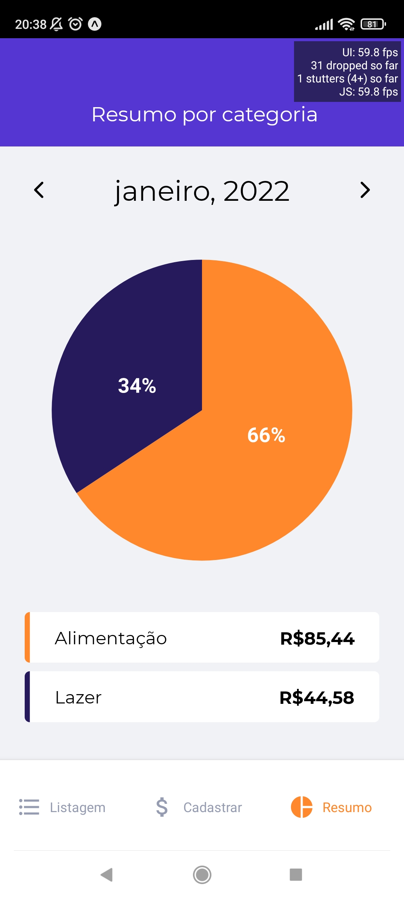

<h1 align="center">
  
</h1>

# GoFinances - Aplicativo de finanças pessoais

> **Nota**: Gofinances é um aplicativo de finanças pessoais, no qual você pode registrar suas transações e monitorá-las, observado as entradas, saídas, saldo e gastos por categoria e data.

# Vizualizar aplicativo com Expo Go

<h1 align="center">

## [Código QR:](https://expo.dev/@robertbernd/gofinances)

  
</h1>

# Telas da aplicação

## Login


<br>

## Home


<br>

## Home com uma transação


<br>

## Cadastro


<br>

## Dashboard


<br>

## Tecnologias usadas

- [React Native](https://reactnative.dev/)
- [Expo](https://docs.expo.dev/)
- [TypeScript](https://www.typescriptlang.org/pt/)
- [AsyncStorage](https://styled-components.com/)
- [Styled-components](https://react-native-async-storage.github.io/async-storage/)
- Login Social com Google
- Login Social com Apple

## Como rodar o projeto

1. Abra o terminal.
2. Acessar a pasta de seus projetos.
3. Dentro da pasta de seus projetos, execute os comandos abaixo:

```bash
# Entrar na pasta do projeto
$ cd gofinances

# Para baixar as dependências do projeto
$ yarn

# Para executar o projeto
$ expo start

```

Made with by [Roberto Fortes](https://github.com/robertofortes23/)
